<!--
SPDX-FileCopyrightText: 2026 pypsa-meets-brazil contributors
SPDX-License-Identifier: CC-BY-4.0
-->

# The Stack, From the Metal Up

**Purpose.** `docs/PRIMER.md` explains the *domain* — power systems, the Brazilian
sector, optimization, stochastic hydro. This document explains the *tooling*: every
piece of software this project runs on, what it is for, and the closest equivalent in
engineering practice.

It is written for an electrical engineer who knows the grid far better than the
toolchain. No prior software engineering knowledge is assumed.

---

## 0. How to read this

The stack is presented as **layers, numbered 0 to 7**. The numbering is not
decoration: each layer runs on top of the one below it. When something breaks, debug
from the bottom up — most confusing failures come from layers 1 to 3.

Two labels appear throughout, and this distinction matters more than anything else in
this document:

| Label | Meaning |
|---|---|
| **BUILT** | Installed, running, and exercised by tests today. |
| **PLANNED** | Named in the roadmap. Not yet installed. Does not exist in the repo. |

> **Read this twice.** Most of the famous names in this project — PyPSA, atlite,
> SDDP.jl, HiGHS — are still **PLANNED**. Four commits in, what exists is the
> plumbing: an environment, a workflow engine, a data-fetching layer with provenance,
> and the quality gates. That is deliberate, and it is the honest state of things.
> Anyone claiming the model runs today would be wrong.

---

## 1. The shape of the whole thing

Strip away the tooling and this project is a pipeline: public Brazilian data goes in
at one end, an optimization problem is built and solved in the middle, and validated
results come out the other. Everything else exists to make that pipeline reproducible.

### What runs today

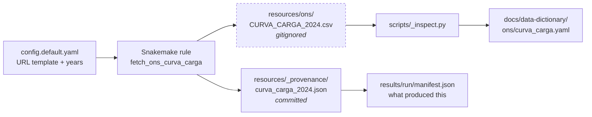

Note what is committed and what is not. The 1.5 MB CSV is **never** committed — it is
regenerable. The 354-byte provenance record **is** committed, because it is the only
thing that can later say which vintage of upstream data a result came from.

### What the pipeline becomes

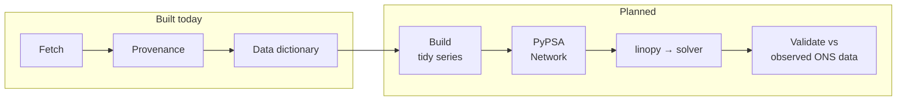

The engineering discipline in this repository is aimed almost entirely at that last
box. It is easy to produce a model that runs. The whole difficulty is being able to
say, a year later, exactly which data and which code produced a published number —
and whether it was ever checked against reality.

### The layers

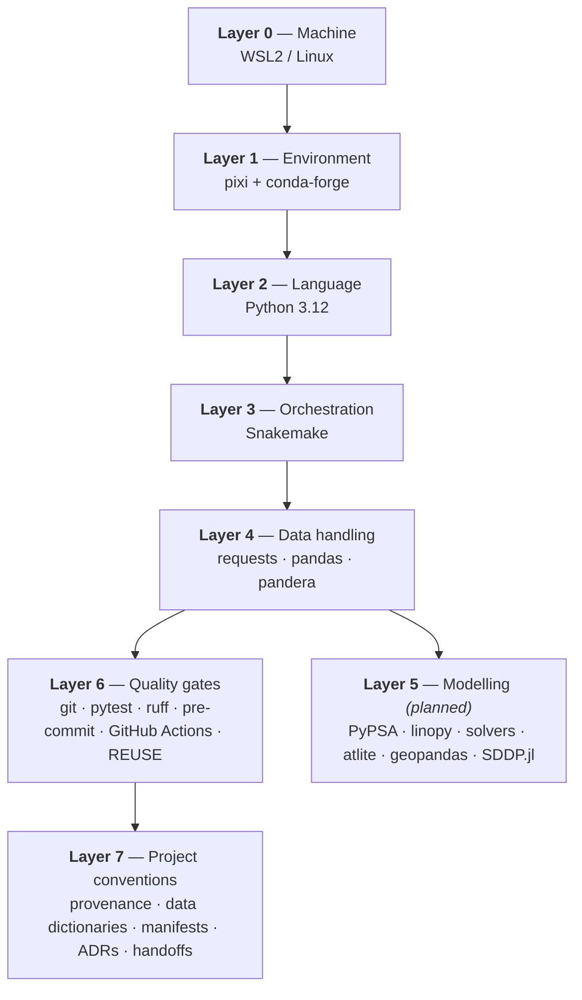

---

## 2. Layer 0 — The machine

### WSL2 (Windows Subsystem for Linux) — **BUILT**

**What it is.** A real Linux system running inside Windows. Your files live at
`/home/lvbon/projects/pypsa-meets-brazil` inside Linux; Windows also exposes the same
files as `\\wsl.localhost\Ubuntu-24.04\...`.

**Why it is here.** Snakemake — the workflow engine the whole project is built around
— does not properly support native Windows. Nearly all scientific Python tooling
assumes Linux.

**Engineering parallel.** Running the analysis on the platform the software was
actually validated on, rather than the one on your desk. The same reason you would not
run a vendor's relay settings tool on an unsupported OS and trust the output.

**What bites you.** There are two views of the same files. Commands must run *inside*
Linux to see the right tools; the Windows-side view is fine for editing but does not
have `pixi` on its path.

---

## 3. Layer 1 — The environment

A Python "environment" is the exact set of libraries available to your code. The most
common way scientific results quietly become irreproducible is that this set changed.

### pixi 0.76.2 — **BUILT**

**What it is.** It reads `pixi.toml` (what we want) and writes `pixi.lock` (exactly
what was resolved — every package, every version, every transitive dependency, with
checksums). `pixi install` rebuilds that set identically on any machine.

**Why it is here.** The geospatial and numerical stack — GDAL, PROJ, HDF5, solvers —
is notoriously version-sensitive. pixi pulls from **conda-forge**, which ships
compiled scientific libraries properly, rather than `pip`, which often does not.

**Engineering parallel.**

| File | Equivalent |
|---|---|
| `pixi.toml` | The specification: "a 230 kV breaker, this rating" |
| `pixi.lock` | The bill of materials: exact manufacturer, part number, revision |

"It worked last month" is not reproducibility.

**The two environments.** `default` is what the workflow needs to run; `dev` adds
testing and linting tools. They share a solve group, so both resolve to consistent
versions rather than drifting apart.

**Currently pinned:** `python 3.12`, `snakemake-minimal`, `pyyaml`, `pandas`, `numpy`,
`requests`, `pandera`, plus `pytest`, `ruff`, `pre-commit` in `dev`. That is the
entire list. Domain libraries are added in the pull request that first genuinely needs
them, which keeps a fresh clone fast.

> **A real gotcha, already paid for.** `snakemake-minimal` lives on the **bioconda**
> channel, not conda-forge. Installation fails with an unhelpful "no candidates were
> found" until bioconda is listed. conda-forge stays first so it still wins for
> everything else.

---

## 4. Layer 2 — The language

Python 3.12 is the working language. If your background is MATLAB, these are the
concepts that cause the most friction, because Python makes distinctions MATLAB
largely does not.

| Term | What it actually means | Example here |
|---|---|---|
| **module** | One `.py` file. Its contents are only available to files that explicitly ask. | `scripts/fetch.py` |
| **import** | "Make that module's contents available here." Nothing is global by default. | `from fetch import download` |
| **function** | A named, reusable block taking inputs and returning a value. Testable in isolation. | `sha256_file(path)` |
| **script** | A file meant to be *run* top to bottom, usually orchestrating functions. | `scripts/fetch_dataset.py` |
| **dict** | A lookup table of key to value. The universal way structured data moves around. | the parsed config |
| **type hint** | An annotation such as `-> str` saying what a function returns. Documentation tools can check. | throughout |

### A design rule this project follows

**Logic lives in importable modules; scripts only wire things together.**

The reason is practical: a function inside a module can be tested automatically,
whereas code buried in a script that expects a workflow engine to hand it inputs
cannot. You see this split everywhere.

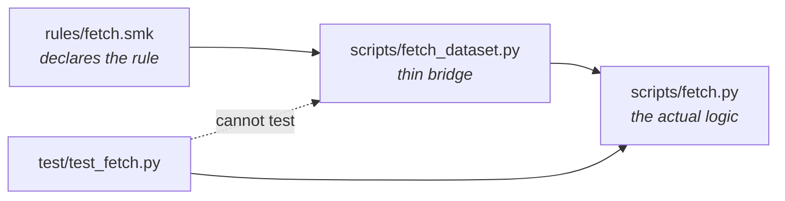

This is why an earlier decision to put logic directly in a `.smk` rule file was
abandoned: Python cannot import `.smk` files, so that code was untestable.

---

## 5. Layer 3 — The conductor

This is the most important tool to understand, because it defines the shape of the
entire repository.

### Snakemake 9.25.1 — **BUILT**

**What it is.** You declare **rules**. Each states its *inputs*, its *outputs*, and
the code that turns one into the other. You never write the execution order. Snakemake
derives the dependency graph by matching one rule's output filenames to another's
inputs.

**Why it is here.**

1. **Incrementality** — change the load builder and only downstream steps rerun. On a
   pipeline involving weather data and multi-hour solves, this is the difference
   between a usable project and an unusable one.
2. **Reproducibility** — the graph *is* the documentation of how every output was made.
3. **Parallelism** — independent steps run concurrently, free.
4. **Wildcards** — one rule generates many outputs.

**Engineering parallel.** A dependency or process flow diagram that is also
executable. The closest everyday analogue is a spreadsheet: you define what each cell
depends on, and when an input changes only the affected cells recalculate.

### Reading a real rule from this repository

```python
rule fetch_ons_curva_carga:
    output:
        raw="resources/ons/CURVA_CARGA_{year}.csv",
        provenance="resources/_provenance/ons/curva_carga_{year}.json",
    params:
        url=lambda wc: config["sources"]["ons"]["curva_carga"]["url"].format(year=wc.year),
    script:
        "../scripts/fetch_dataset.py"
```

`{year}` is a **wildcard** — a blank Snakemake fills in from whatever was requested.
Ask for `CURVA_CARGA_2024.csv` and it matches this rule with `year = 2024`. One rule
covers every year from 2000 onward; you never write it twice. The same mechanism will
later produce the four model tiers from a single set of rules.

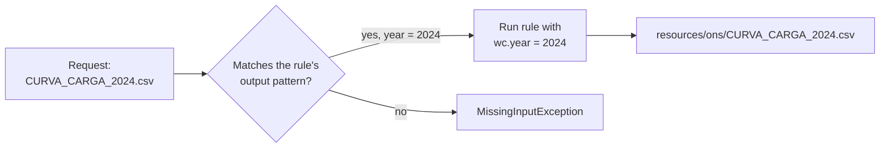

### The DAG, and the cheapest check in the project

**DAG** means directed acyclic graph: work flows one way and never loops back.

`snakemake -n` performs a **dry run** — it resolves the whole graph and prints what
*would* execute, without executing anything. It catches malformed rules, broken
wildcards and missing inputs in about a second, and it runs in CI on every change.

### One deliberate design decision worth knowing

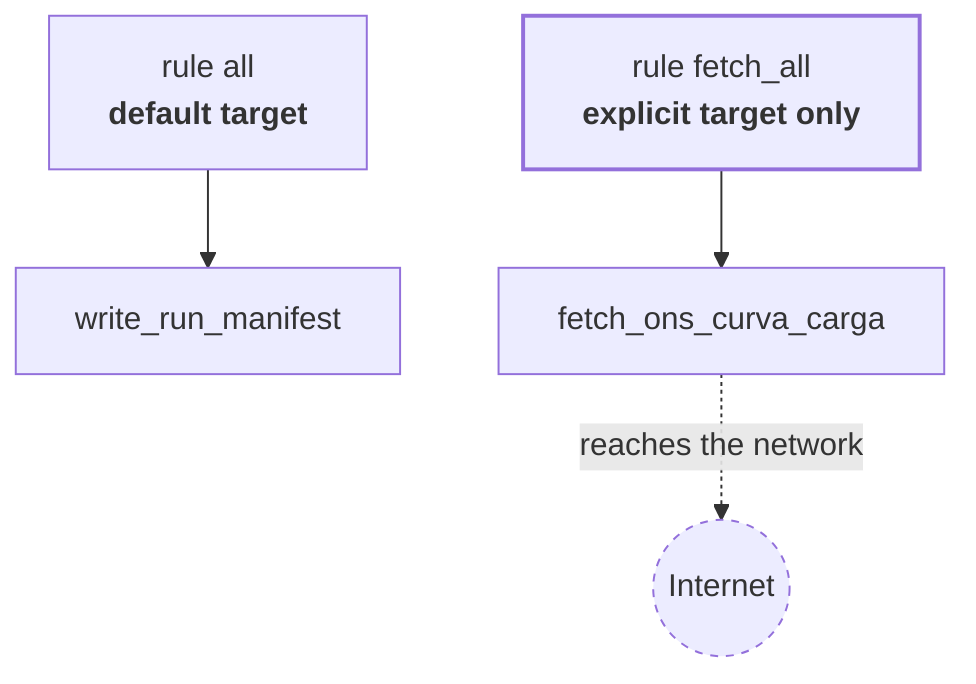

The fetch rules are reachable only through `fetch_all` and are **not** part of the
default `all` target. Fetching touches the network; the default workflow and the
automated tests must run offline, with no credentials and no dependence on a
government portal being up. Downloading data is always an explicit request, never a
side effect.

---

## 6. Layer 4 — Moving and checking data

### requests — **BUILT**

Downloads files over HTTPS. It streams them to disk in 1 MiB chunks rather than
loading the whole file into memory, which matters once datasets reach gigabytes.

### pandas 3.0.5 — **BUILT**

**What it is.** The `DataFrame`: a table with named, typed columns. The universal
currency of data work in Python.

**Engineering parallel.** A measurement table or SCADA export where each column has a
name, a unit and a data type — and, unlike a spreadsheet, the type is enforced.

**Worth knowing.** Version 3.0 changed how text columns are reported (`str` where
older versions said `object`). This project records column types in committed files,
so a pandas upgrade will visibly change them. That is documented rather than
discovered later in a panic.

### pandera 0.32.1 — **BUILT**

**What it is.** Declares what a table *must* look like — which columns, which types,
whether nulls are allowed — and raises an error at the boundary if incoming data does
not match.

**Why it matters here specifically.** ONS and ANEEL change their published files
without notice. Without this, a renamed or retyped column produces a silently wrong
number somewhere downstream. With it, the build fails loudly and names the offending
column.

**Engineering parallel.** Factory acceptance testing on incoming equipment. You verify
against the specification at the boundary, not after it is installed in the substation.

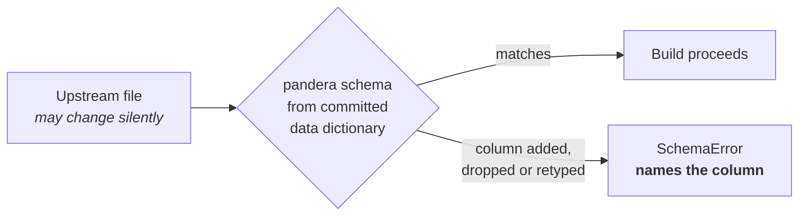

### The file formats, and why each is used

| Format | Nature | Used here for |
|---|---|---|
| `.csv` | Plain text, one row per line | Raw ONS downloads. Semicolon-separated, period decimals. |
| `.yaml` | Human-friendly structured text | Configuration and data dictionaries — meant to be read and edited. |
| `.json` | Machine-friendly structured text | Provenance records and run manifests — written and read by code. |
| `.toml` | Configuration format | `pixi.toml`, `pyproject.toml` — tool settings. |
| `.parquet` | Compressed binary table | *(planned)* Intermediate data. Far smaller, preserves column types. |
| `.nc` | NetCDF, scientific arrays | *(planned)* Weather data and saved PyPSA networks. |

> **The unit trap, which is not hypothetical.** The load column is in **MWmed** —
> average power over the interval, not energy. At hourly resolution MWmed and MWh are
> numerically identical, so an error hides perfectly. It stops hiding the moment the
> series is joined to one of the half-hourly ONS datasets, at which point everything
> is wrong by a factor of two. This is why the data dictionary records units
> explicitly, and why a test asserts that field says `MWmed`.

---

## 7. Layer 5 — The modelling layer

None of this is installed yet. It is the destination, and it is the layer where your
existing knowledge does most of the work.

### PyPSA — **PLANNED**

A `Network` object holding `Bus`, `Line`, `Link`, `Generator`, `Load`, `StorageUnit`.
Static properties sit in DataFrames (`n.generators`); time series sit in parallel
structures (`n.generators_t.p_max_pu`). Calling `n.optimize()` assembles the
optimization problem, solves it, and writes results back onto the object.

Its real value is that it encodes correct formulations — DC power flow, storage
dynamics, unit commitment — so you are not re-deriving them and getting a sign wrong.

**Where prices come from.** `n.buses_t.marginal_price`. These are the dual variables
of the nodal energy balance constraints — the locational marginal price, and in
Brazil's zonal formulation the CMO. You do not compute prices separately; you read
them off the solved model.

### linopy — **PLANNED**

The layer PyPSA uses to construct the LP or MILP and hand it to a solver.

Strategically it matters because it is **the seam for customization**. Anything PyPSA
does not model natively enters through here — the stochastic hydro coupling, and
head-dependent hydro productivity.

### Solvers: HiGHS / Gurobi / COPT — **PLANNED**

HiGHS is open source, excellent for LP, adequate for modest MILP — the intended
default. Gurobi and COPT are commercial, dramatically faster on hard MILP, and free
for academic use.

Full nodal Brazil at 8760 hours with unit commitment is a large MILP; HiGHS will not
carry it. Budget for an academic licence. The solver is a configuration switch, not an
architectural commitment, and should stay that way.

> `config.default.yaml` already names `highs`, but **no solver is installed yet**.
> That setting is currently aspirational.

### atlite + ERA5 — **PLANNED**

Takes a *cutout* — a regional subset of the ERA5 global weather reanalysis — and
applies turbine power curves and PV models to produce capacity factor time series per
location.

**The catch, and Brazil's advantage.** ERA5 wind is biased low by roughly 20% and
solar high. Uncorrected, the model builds the wrong system. Brazil publishes *hourly
generation per plant*, so correction can be done against observed output at individual
plants rather than a national aggregate. Most countries cannot do this. It is one of
this project's strongest differentiators.

### inewave / idecomp / idessem — **PLANNED**

Parse the fixed-width Fortran-era files of the official Brazilian model chain into
pandas. This is how `hidr.dat` (hydro plant physical cadastre) and `VAZOES.DAT` (the
~95-year natural inflow record) get read. Hand-parsing them is a well-known way to
lose a week.

### SDDP.jl (Julia) — **PLANNED**

**Why a second language appears.** SDDP.jl is the mature, well-tested implementation
of Stochastic Dual Dynamic Programming, with risk measures such as CVaR built in.
Reimplementing it in Python would be a large, bug-prone project with no upside.

**How it couples** — deliberately loosely:

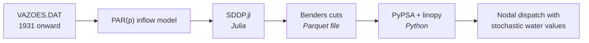

Snakemake runs Julia as a separate stage; data crosses as Parquet files. No in-process
bridge, nothing fragile to debug across a language boundary.

What it produces is **Benders cuts** — linear lower bounds on the cost-to-go function.
Their slopes are the dual variables of the storage balance constraints, which is to
say: the water values. The same shadow-price idea that gives you nodal prices gives
you the value of stored water.

### Also planned

`geopandas` and `shapely` for spatial joins — watch coordinate reference systems, as
Brazilian sources mix SIRGAS 2000 and WGS 84 and a mismatch produces silently wrong
joins rather than errors. `earth-osm` for OpenStreetMap geometry. OpenDSS for the
targeted distribution feeder track.

### The model tiers

One source of truth, clustered downward — never built separately:

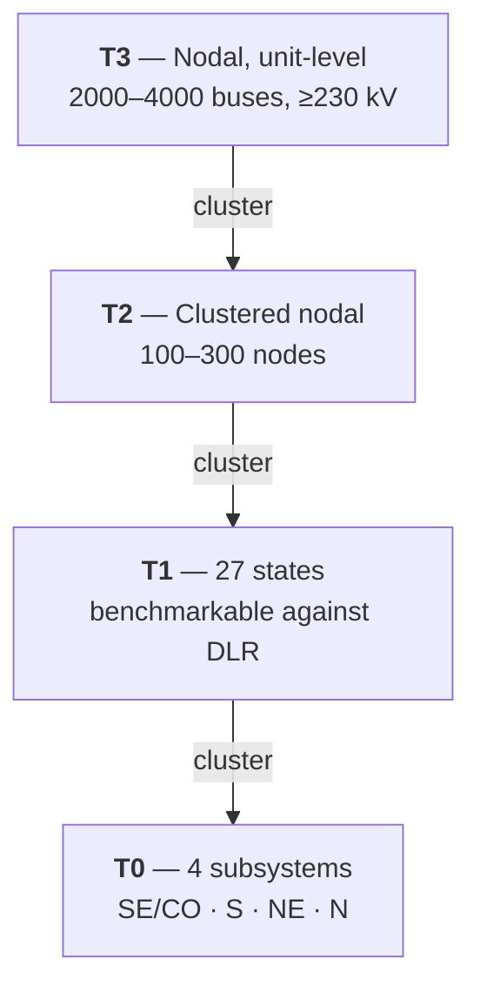

Subsystem boundaries are preserved as hard constraints during clustering. Aggregating
across one destroys the quantity you are trying to validate against.

---

## 8. Layer 6 — The safety net

These tools model nothing. They exist to catch mistakes early and cheaply, which on a
project built across many sessions is not optional.

### git — **BUILT**

**The three words.** A **commit** is a snapshot of every file plus a message
explaining why. A **branch** is an independent line of work. A **pull request**
proposes merging one into the main line, with review.

**This project's convention — squash-merge only.** Each pull request collapses to
exactly one commit on `main`. So `git log --oneline` reads as a project narrative
instead of a stream of "wip" and "fix typo"; reverting a feature means reverting one
commit; and a future session can load the entire history cheaply.

**Conventional Commits.** Messages begin with a type — `feat:`, `fix:`, `docs:`,
`data:`. Machine-readable, so changelogs and version numbers can be derived rather
than curated by hand. A hook rejects messages that do not comply.

### pytest 9.1.1 — **BUILT** (49 tests)

Functions whose names begin with `test_` that assert something must be true. They run
in about a second.

**The three layers, and what each is worth:**

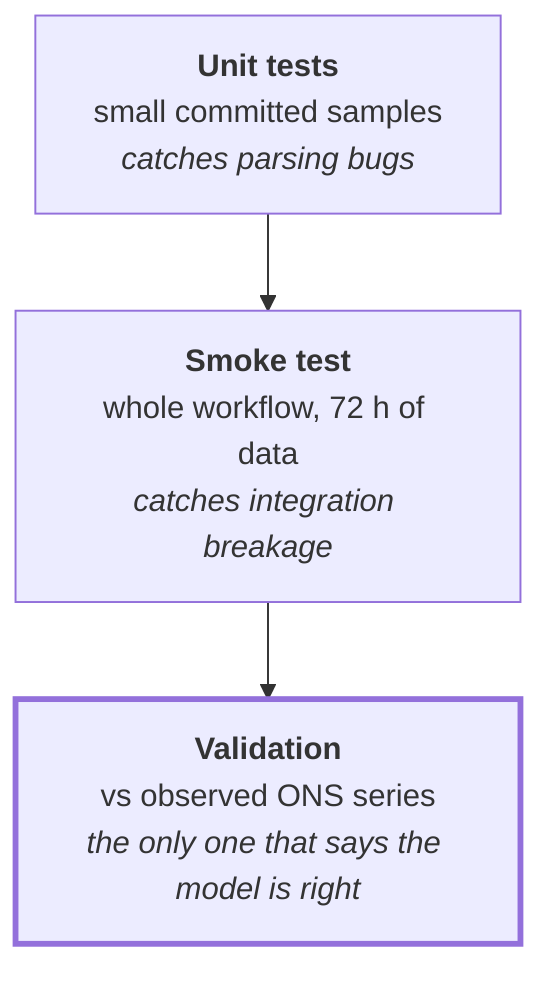

| Layer | Engineering parallel |
|---|---|
| Unit test | Component test |
| Smoke test | Energisation check |
| Validation | Performance test against field measurements |

**"All tests pass" and "the model is correct" are entirely different claims.** A model
predicting negative demand can pass every test in this repository.

**Fixtures and mocks.** A *fixture* is a small committed sample of real data. A *mock*
is a stand-in — the download tests use a fake HTTP response, so they never touch the
network and cannot fail because a portal is down.

### ruff — **BUILT**

Two jobs. The *formatter* enforces one layout so diffs show real changes rather than
whitespace. The *linter* flags likely bugs — unused imports, shadowed variables,
suspicious constructs.

**Engineering parallel.** Drafting standards for a drawing set. Uniform line weights
and title blocks are not aesthetic preferences; they make deviations visible.

### pre-commit — **BUILT**

Runs a battery of checks automatically every time you commit, and refuses the commit
if any fail: formatting, linting, trailing whitespace, valid YAML/JSON/TOML,
merge-conflict markers, oversized files, spelling, licence headers, commit message
format.

The large-file check matters because committing a multi-gigabyte dataset into git is
effectively permanent. The 1 MB limit is the backstop.

### GitHub Actions — **BUILT**, but never yet executed

The same checks re-run on GitHub's servers on every push, on a clean machine, so "it
works on mine" cannot hide a missing dependency. Three workflows: `lint`, `test`,
`meta`.

**The hard rule: CI never downloads real data.** No credentials, no flakiness, no
multi-gigabyte pulls, no dependence on a portal being available. Committed fixtures
only.

**Honest status.** These workflow files have never actually run — the repository has
no remote yet. They are written and locally equivalent, but unverified against real
runners.

### REUSE — **BUILT**

Checks that every file declares its copyright and licence. MIT for code, CC-BY-4.0 for
documentation.

**A correction made in PR-04.** Files derived from ONS data now carry *ONS's*
copyright, not this project's. Their data is published under Creative Commons
Attribution, and attribution is exactly what that licence requires — claiming our own
copyright over their bytes was wrong.

---

## 9. Layer 7 — What this project invented for itself

Nothing here is a third-party tool. These are small pieces of machinery written for
this repository, and they are the part most worth understanding, because they encode
*why* the project is built the way it is.

**The reasoning.** This model is built across many working sessions, over a long
horizon, against data sources that change upstream without notice. Three failure modes
follow, each needing a structural defence rather than good intentions:

1. Sessions re-discovering what earlier ones already learned.
2. Nobody being able to say, six months later, which data vintage produced a figure.
3. Judgement calls buried in code, where they cannot be defended in review or a paper.

### The four-layer change log

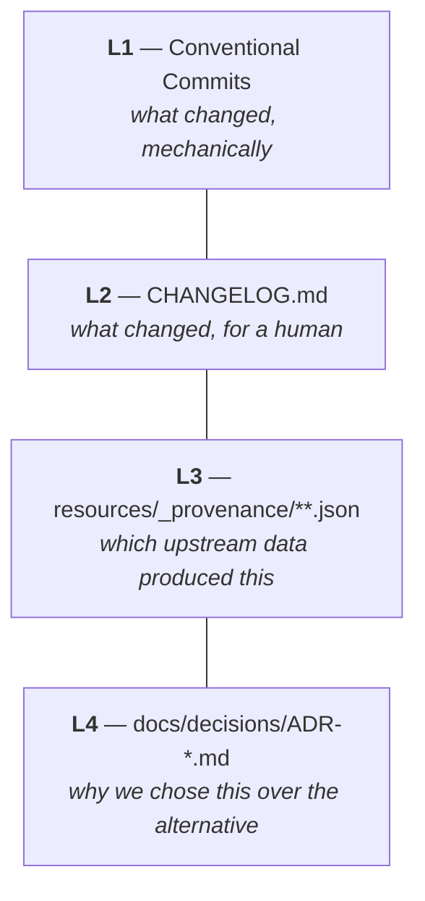

### Provenance records — **BUILT**

Source URL, retrieval timestamp, sha256 checksum, byte size, row count. Written on
every fetch and committed to git, even though the data itself never is.

**What sha256 is.** A fixed-length fingerprint computed from the file's contents. Any
change, however small, produces a completely different value. It is a tamper-evident
seal — and it lets you prove two downloads were byte-identical. (Re-running the fetch
rule in PR-04 reproduced the earlier manual download's hash exactly, which is how we
know the fetch is deterministic.)

**Engineering parallel.** A calibration certificate for an instrument. The measurement
alone is not defensible; the measurement plus its traceability is.

### Data dictionaries — **BUILT**

**The rule: read the dictionary, never read the raw file.** Raw inputs run from
100,000-row CSVs to multi-gigabyte geodatabases. The dictionary is about 2 KB and says
everything needed to write correct code against the data — columns, types, units, null
rates, sample values, source URL.

**The two fields that matter most** are `unit` and the free-text `notes`. No tool can
infer them; they must be written by hand after inspection. They are also where the
real bugs come from, because Brazilian sector data mixes MW, MWmed, MWh and "percent
of useful volume" freely, and the distinction is rarely in the column name.

**Enforced, not merely encouraged.** A test fails the build if any committed
dictionary has an undocumented column or no notes. A generated-but-never-inspected
dictionary is worse than none, because it is confidently wrong.

### Run manifest — **BUILT**

Configuration hash, full config, git commit SHA and whether the working tree was
dirty, Python and platform versions, and the embedded provenance record of every input
consumed.

It records a *dirty* tree explicitly rather than hiding it. A result produced from
uncommitted changes is not reproducible, and the manifest says so instead of implying
the commit alone explains it.

**Engineering parallel.** The header block of a test report: which unit, which
settings, which firmware revision, which date. Nobody accepts the results table
without it.

### ADRs — **BUILT**

Short records of a consequential decision, the alternatives rejected, and the
reasoning — written when the decision is made, and immutable afterwards. Changing a
decision means writing a new record that supersedes the old one.

This project is full of choices that are assumptions rather than facts: bus-level load
allocation, impedance synthesis, bias-correction method, aggregated versus
individualised reservoirs. Every one will be questioned in review. The reasoning is
worth far more written down at the time than reconstructed a year later.

### Handoff notes — **BUILT**

Twenty to forty lines per pull request, recording only what is *not* visible in the
code: gotchas, dead ends, upstream quirks, why an obvious approach was rejected, what
surprised us.

A minute to write, a session saved. Brazilian sector data is full of traps that cost
real time and leave no trace in a diff.

### Meta checks — **BUILT**

`scripts/check_meta.py` enforces that a change to code also updates the changelog,
that every provenance record has the required fields, and that ADR numbers are unique.

Discipline decays under time pressure; checks that run automatically do not. If the
process slips, the build fails rather than the slip passing quietly.

### The session budget

Each pull request must fit one working session: at most 12 files changed, roughly 600
new lines of Python, **exactly one** conceptual concern, at most 3 new dependencies,
and never reading raw data into a working session. Anything larger is split before
work begins.

The trade is accepted deliberately — the alternative is a pull request that looks
finished and is not.

---

## 10. The file map

| Path | Purpose |
|---|---|
| `Snakefile` | Workflow entry point. Defines `all` and `fetch_all`. |
| `rules/common.smk` | Makes shared helper functions visible to the workflow. |
| `rules/fetch.smk` | Data acquisition rules. Currently the ONS load fetch. |
| `scripts/_common.py` | Config hashing and run naming. |
| `scripts/fetch.py` | Download, checksum, write the provenance record. |
| `scripts/fetch_dataset.py` | Thin bridge connecting a Snakemake rule to `fetch.py`. |
| `scripts/_inspect.py` | Generate a data dictionary; derive a validation schema from one. |
| `scripts/write_manifest.py` | Write the run manifest. |
| `scripts/check_meta.py` | Changelog, provenance and ADR-numbering checks. |
| `config/config.default.yaml` | Tier, snapshots, subsystems, solver, data sources. |
| `config/test/config.smoke.yaml` | 72-hour configuration for the fast end-to-end check. |
| `test/` | 49 tests, plus fixtures — real ONS samples and one labelled synthetic file. |
| `docs/PRIMER.md` | The domain primer: physics, sector, optimization, stack overview. |
| `docs/STACK.md` | This document. |
| `docs/decisions/` | ADRs. |
| `docs/handoffs/` | Session handoff notes. |
| `docs/data-dictionary/` | Dataset schema snapshots. |
| `pixi.toml`, `pixi.lock` | Environment specification and exact resolved versions. |
| `pyproject.toml` | Settings for ruff, pytest and mypy. |
| `resources/` | Downloaded data. Gitignored, *except* `_provenance/`. |
| `results/` | Run outputs and manifests. Gitignored. |

---

## 11. Commands you will actually type

All of these run **inside WSL**, from the repository directory.

```bash
# Rebuild the environment exactly as locked
pixi install -e dev

# Resolve the workflow graph without running anything.
# The cheapest sanity check in the project - use it constantly.
pixi run -e dev snakemake -n

# Run the whole workflow on the tiny smoke configuration
pixi run -e dev snakemake -j4 --configfile config/test/config.smoke.yaml

# Download the configured upstream data.
# The only command that touches the network - never runs automatically.
pixi run -e dev snakemake -j2 fetch_all

# Run the tests
pixi run -e dev pytest -ra

# Run every quality gate, exactly as the commit hook will
pixi run -e dev pre-commit run --all-files

# Read the project's story so far
git log --oneline
```

**If something looks wrong,** work bottom-up through the layers:

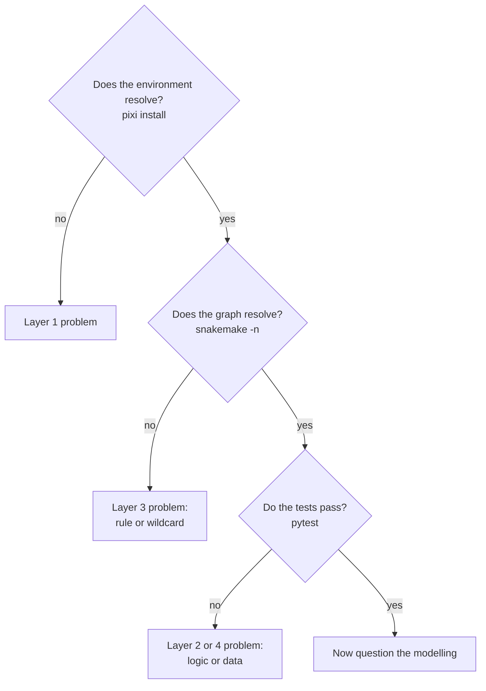

---

## 12. Glossary

Software terms only — the power systems vocabulary is in `docs/PRIMER.md`.

| Term | Meaning |
|---|---|
| **CI** | Continuous integration. Automated checks run on a clean machine on every change. |
| **commit** | A saved snapshot of the whole project, with a message explaining why. |
| **DAG** | Directed acyclic graph. The workflow's dependency structure: one way, never looping. |
| **DataFrame** | A table with named, typed columns — the standard tabular object in Python. |
| **diff** | The exact line-by-line changes between two versions. Review means reading the diff, not the summary. |
| **dry run** | Reporting what would happen without doing it. `snakemake -n`. |
| **dtype** | The data type of a column — integer, float, text, timestamp. |
| **fixture** | A small, committed sample of real data that tests run against. |
| **gitignore** | Paths git deliberately does not track — here, all downloaded and generated data. |
| **hash / sha256** | A fixed-length fingerprint of a file's contents. Any change gives a completely different value. |
| **hook** | A check that runs automatically at a git event, such as before a commit is accepted. |
| **lockfile** | Exact resolved versions of every dependency, so an environment rebuilds identically. |
| **linter** | A tool that flags likely bugs and style violations without running the code. |
| **LP / MILP** | Linear program; mixed-integer linear program. On/off variables break convexity and make it far harder. |
| **mock** | A stand-in for something real — a fake HTTP response — so tests stay fast and offline. |
| **provenance** | The recorded origin of data: where from, when, verified how. |
| **regression** | Something that used to work and no longer does. Tests exist mainly to catch these. |
| **repository** | The project directory together with its complete version history. |
| **rule** | In Snakemake: a declared step with inputs, outputs and the code between them. |
| **schema** | The declared structure of a dataset: columns, types, what may be missing. |
| **smoke test** | A fast end-to-end run proving the pipeline is wired together. Says nothing about correctness. |
| **squash-merge** | Collapsing a pull request's commits into exactly one on the main branch. |
| **staging** | Marking changes for inclusion in the next commit (`git add`). |
| **wildcard** | A blank in a Snakemake filename pattern, filled from what was requested. One rule, many outputs. |
| **working tree** | Your files as they are right now. "Dirty" means changed but not committed. |
| **YAML** | Human-readable structured text, used for configuration and dictionaries. Indentation is significant. |
